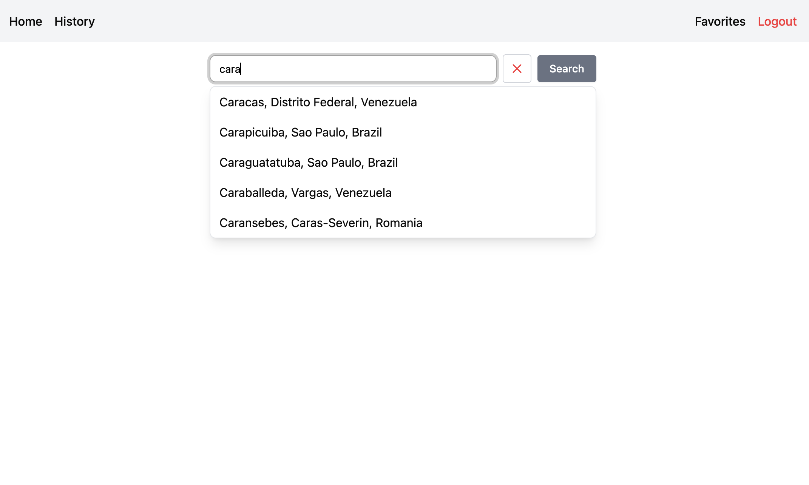
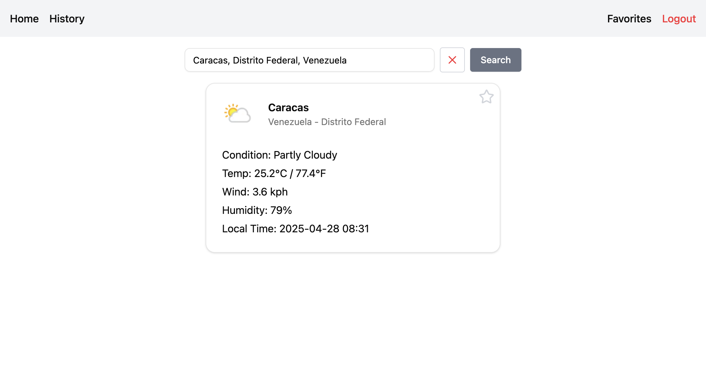
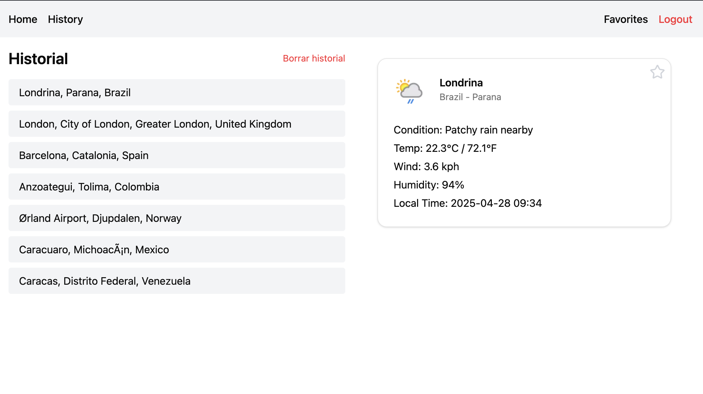
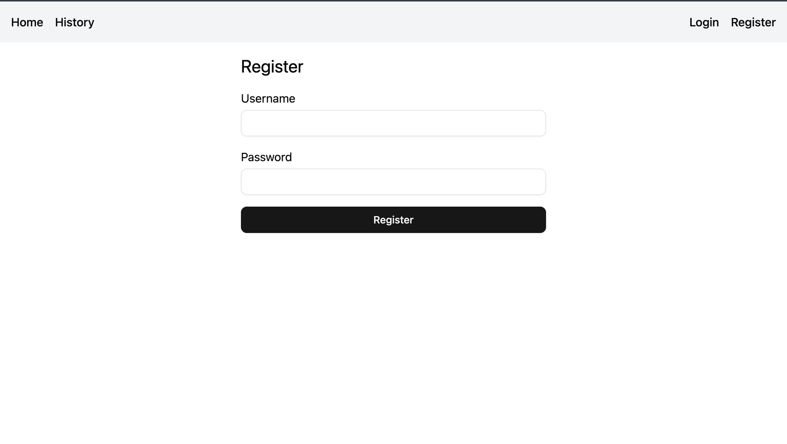

# 🌦️ Pulpo Line Weather App

Aplicación fullstack que consume una API de clima (WeatherAPI), con **registro/login**, **búsqueda con autocompletado**, **historial local**, **favoritos por usuario** y **detalle meteorológico**.

---

## 📖 Descripción del proyecto

1. **Autenticación**

   - Registro (`POST /auth/register`)
   - Login (`POST /auth/login`) → devuelve JWT

2. **Búsqueda de ciudades**

   - Autocompletado: `GET /weather/autocomplete?query=texto`

3. **Clima actual**

   - `GET /weather?city=NombreCiudad` → temperatura, viento, humedad, hora, ícono

4. **Historial local**

   - Guarda cada consulta en `localStorage` y muestra en `/history`

5. **Favoritos (persistentes)**
   - CRUD sobre `/weather/favorites` (requiere JWT)
   - `GET /weather/favorites`
   - `POST /weather/favorites` `{ city }`
   - `DELETE /weather/favorites/:id`

---

## 🔗 Endpoints

| Método | Ruta                                  | Descripción                            | Auth    |
| ------ | ------------------------------------- | -------------------------------------- | ------- |
| POST   | `/auth/register`                      | Crear nuevo usuario                    | Público |
| POST   | `/auth/login`                         | Autenticarse (devuelve `access_token`) | Público |
| GET    | `/weather/autocomplete?query=<texto>` | Sugerencias de ciudades                | Público |
| GET    | `/weather?city=<ciudad>`              | Datos de clima actual                  | Público |
| GET    | `/weather/favorites`                  | Listar favoritos del usuario           | Privada |
| POST   | `/weather/favorites`                  | Añadir favorito `{ city }`             | Privada |
| DELETE | `/weather/favorites/:id`              | Eliminar favorito por `id`             | Privada |

---

## 🛠️ Tecnologías

- **Frontend**: React, Vite, TypeScript, React Router, axios, framer-motion, shadcn/ui
- **Backend**: NestJS, TypeScript, TypeORM, PostgreSQL, Redis, Passport-JWT, class-validator
- **Cache**: Redis (autocomplete + datos de clima)
- **Contenedores**: Docker (Dockerfile en `/frontend` y `/backend`) + Docker Compose + Makefile

---

## 🔧 Variables de entorno

Crea un `.env` en la raíz (`/pulpo_line/.env`):

```env
# PostgreSQL
DB_USER=postgres
DB_PASSWORD=postgres
DB_NAME=weather
DB_HOST=db
DB_PORT=5432

# WeatherAPI
WEATHER_API_KEY=tu_api_key_aqui

# Redis
REDIS_HOST=redis
REDIS_PORT=6379
```

Además, en **frontend** (`/frontend/.env`):

```env
VITE_BACKEND_URL=http://localhost:8000
```

Y en **backend** (`/backend/.env`) puedes repetir las mismas variables que están en la carpeta raíz si lo arrancas por separado.

---

## 🚀 Levantar todo con Docker

En la carpeta raíz (`/pulpo_line`):

```bash
# Primer build y arranque
make up

# Ver logs
make logs

# Detener todo
make down

# Reconstruir
make restart
```

Si prefieres Docker Compose directamente:

```bash
docker-compose up --build -d
docker-compose logs -f
docker-compose down
```

| Servicio      | URL                   |
| ------------- | --------------------- |
| Frontend (UI) | http://localhost:3000 |
| Backend (API) | http://localhost:8000 |

---

## 🐳 Levantar sin Docker

1. **Backend**
   ```bash
   cd backend
   pnpm install
   cp ../.env .
   pnpm run start:dev
   ```
2. **Frontend**
   ```bash
   cd frontend
   pnpm install
   cp ../.env .
   pnpm run dev
   ```

---

## 🧪 Pruebas unitarias

### Backend (Jest)

1. **WeatherService.getWeatherByCity**: mockear `HttpService` y validar estructura de `WeatherData`.
2. **WeatherService.getAutocompleteByCity**: con mock de Redis y mock de API, validar caché y formato `"Ciudad, Región, País"`.
3. **WeatherService.createFavorites / deleteFavorites**: mock de repositorio, asegurarse de crear y borrar solo para `userId` correcto.

Ejecutar:

```bash
cd backend
pnpm run test
```

### Frontend (Vitest + Testing Library)

1. **useDebounce**: simular temporizador y verificar que el valor se actualiza tras el delay.
2. **SearchBar**: mock de API (`vi.spyOn`), tipear texto y comprobar que aparecen sugerencias.

Ejecutar:

```bash
cd frontend
pnpm run test
```

---

## ⚙️ Despliegue

- Cada carpeta (`/backend`, `/frontend`) tiene su propio `Dockerfile`.
- El `docker-compose.yml` en la raíz orquesta:
  - `db` (PostgreSQL)
  - `redis`
  - `backend`
  - `frontend`
- El **Makefile** simplifica comandos (`make up`, `make down`, etc.).

---

## 💡 Decisiones técnicas

- **Separación frontend/backend** en contenedores, fácil de escalar.
- **Redis** para cachear resultados y mejorar latencia.
- **JWT** para proteger rutas de favoritos.
- **TypeORM** con relaciones y validaciones automáticas.
- **React + Vite** para fast refresh y bundles livianos.
- **Framer Motion** y **shadcn/ui** para una UI fluida y moderna.

---

## 👤 Autor

> Pulpo Line Weather App – desarrollado por _Joseph Boscán_ como prueba técnica Fullstack React-Nest.js (React · NestJS · Redis · PostgreSQL · TypeScript · Docker).

## 📸 Capturas de Pantalla

  
Vista de sugerencias.

  
Vista de resultado.

  
Vista de historial.

  
Vista de favoritos.

  
Vista de Inicio de sesión.

  
Vista de registro.
